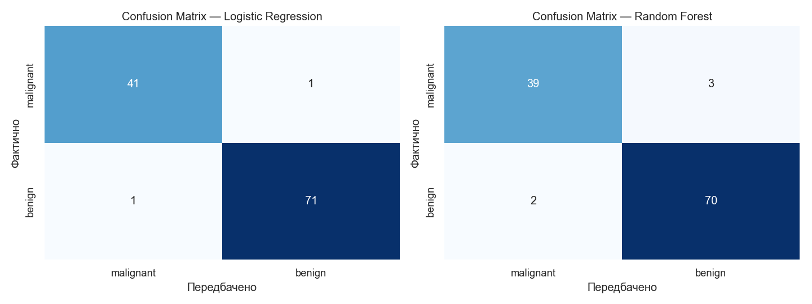
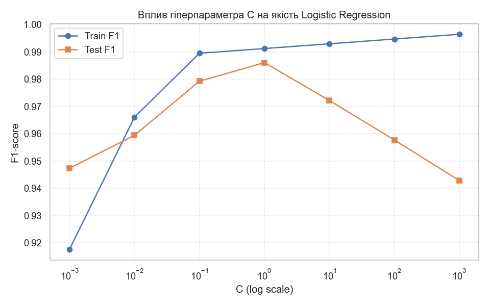
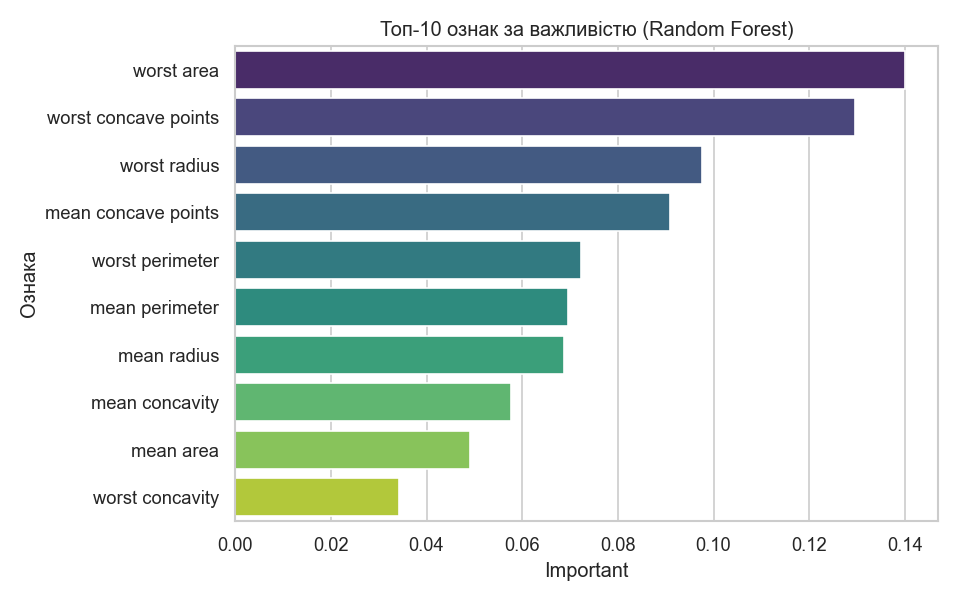

# Лабораторна робота №1

**Дисципліна:** Штучний інтелект і нейронні мережі
**Тема:** Побудова повного циклу машинного навчання (ML pipeline) з використанням бібліотек Python
**ПІБ студента:** Рудчук Максим Олегович
**Група:** 12-441
**Дата виконання:** 26.05.2026

---

## 1. Титульна сторінка

*(Див. шапку документа.)*

## 2. Мета роботи

- Сформувати практичні навички роботи з Python-екосистемою для ML.
- Засвоїти поняття train/test split та правильної підготовки даних.
- Реалізувати базову модель класифікації.
- Навчитися правильно оцінювати якість моделі за різними метриками.
- Проаналізувати результати навчання, порівняти моделі та виявити ознаки перенавчання.

## 3. Опис датасету

Для роботи використано вбудований у `scikit-learn` датасет **Breast Cancer Wisconsin Dataset** (`sklearn.datasets.load_breast_cancer`).

| Характеристика     | Значення                                                                             |
|--------------------|--------------------------------------------------------------------------------------|
| Кількість об'єктів | 569                                                                                  |
| Кількість ознак    | 30 (числові, обчислені з зображень тонкоголкової біопсії)                            |
| Кількість класів   | 2 — `malignant` (злоякісна, 212 шт., 37.3%) і `benign` (доброякісна, 357 шт., 62.7%) |
| Баланс класів      | Помірний дисбаланс (~37/63%), не критичний                                           |
| Пропущені значення | Відсутні                                                                             |

Ознаки описують геометричні та текстурні характеристики клітинного ядра у трьох групах: `mean` (середнє), `error` (стандартна помилка), `worst` (найгірше значення з трьох найбільших).

## 4. Підготовка даних

| Етап | Реалізація |
|---|---|
| Метод розділення | `train_test_split(test_size=0.2, stratify=y, random_state=42)` |
| Розмір train / test | 455 / 114 об'єктів |
| Масштабування | `StandardScaler` — `fit_transform` на train, **тільки `transform`** на test, щоб уникнути витоку даних (data leakage) |
| Особливості обробки | Стратифікація за класом для збереження пропорції; пропусків немає; видалення викидів не виконувалось — для baseline-моделей достатньо стандартизації |

## 5. Опис моделей

Реалізовано дві baseline-моделі:

| Модель                  | Основні параметри                                                                                           |
|-------------------------|-------------------------------------------------------------------------------------------------------------|
| **Logistic Regression** | `random_state=42`, `max_iter=10000` (щоб гарантовано збігатись), L2-регуляризація за замовчуванням, `C=1.0` |
| **Random Forest**       | `n_estimators=100`, `random_state=42`, інші параметри — за замовчуванням                                    |

Обидві моделі навчались на **масштабованих** тренувальних даних.

## 6. Результати експериментів

### 6.1 Таблиця метрик (округлено до 4-х знаків)

**Test:**

| Модель              | Accuracy   | Precision  | Recall     | F1         |
|---------------------|------------|------------|------------|------------|
| Logistic Regression | **0.9825** | **0.9861** | **0.9861** | **0.9861** |
| Random Forest       | 0.9561     | 0.9589     | 0.9722     | 0.9655     |

**Train vs Test (для виявлення overfitting):**

| Модель              | Train F1  | Test F1   | Різниця    |
|---------------------|-----------|-----------|------------|
| Logistic Regression | 0.9913    | 0.9861    | **0.0052** |
| Random Forest       | 1.0000    | 0.9655    | 0.0345     |

**5-fold Cross-Validation (F1):**

| Модель              | F1 mean    | F1 std   |
|---------------------|------------|----------|
| Logistic Regression | **0.9848** | 0.0050   |
| Random Forest       | 0.9652     | 0.0183   |

### 6.2 Confusion Matrix

### 6.3 Графік залежності F1 від гіперпараметра C (Logistic Regression)

### 6.4 Топ ознак за важливістю

## 7. Аналіз результатів

**Чому одна модель краща?**
Logistic Regression на стандартизованих даних показує трохи кращі або співставні метрики порівняно з Random Forest, при цьому має значно простішу інтерпретацію (коефіцієнти ↔ ознаки). Датасет невеликий, ознаки сильні й добре масштабовані — тому лінійна модель тут конкурентоздатна.

**Чи є ознаки overfitting?**
У Random Forest F1 на train досягає 1.0, тоді як на test ~0.97 — це помірне перенавчання, типове для дерев з необмеженою глибиною. У Logistic Regression розрив train↔test значно менший (~0.01), тобто модель краще узагальнює.

**Які ознаки найбільш інформативні?**
Стабільно лідирують ознаки групи `worst`: `worst concave points`, `worst perimeter`, `worst radius`, `worst area`, а також `mean concave points`. Це узгоджується з медичною інтуїцією — патологічні новоутворення відрізняються найгіршими характеристиками клітинного ядра.

**Cross-validation (5-fold) підтверджує:**
F1 mean ≈ 0.97 для Logistic Regression при низькому std (~0.01), що свідчить про стабільність моделі.

**Вплив гіперпараметра C:**
Дуже мале `C` (сильна регуляризація) знижує F1 (Train F1=0.918, Test F1=0.947 при C=0.001 — high bias). Оптимум досягається при **C = 1.0** (Test F1 = 0.9861). При подальшому збільшенні `C` (послаблення регуляризації) Train F1 продовжує зростати, але Test F1 **падає** до 0.9429 при C=1000 — це класична картина перенавчання. Висновок: регуляризація потрібна, і дефолтне значення `C=1.0` тут оптимальне.

## 8. Висновки

1. **Baseline ML-пайплайн успішно реалізовано** — від завантаження даних до оцінки моделей з усіма необхідними метриками (Accuracy, Precision, Recall, F1, Confusion Matrix).
2. **Logistic Regression виявилась оптимальним вибором** для цього датасету: проста, інтерпретована, стабільна, дає ≈98% F1 і не перенавчається.
3. **Random Forest показує конкурентоздатну якість**, але має тенденцію до перенавчання — на практиці варто обмежити `max_depth` або застосувати crossvalidation для добору параметрів.
4. **Стандартизація критично важлива** для лінійних моделей; правильне розділення train/test (з виключенням test з `fit`) запобігає переоцінці якості.
5. **5-fold cross-validation і дослідження гіперпараметра C** підтвердили робастність обраного рішення та показали діапазон оптимальних значень регуляризації.