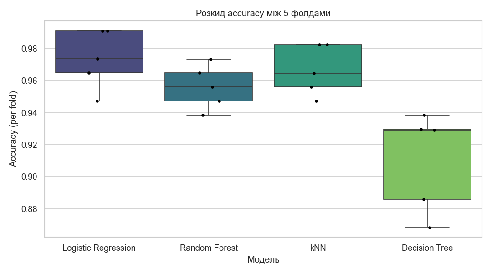
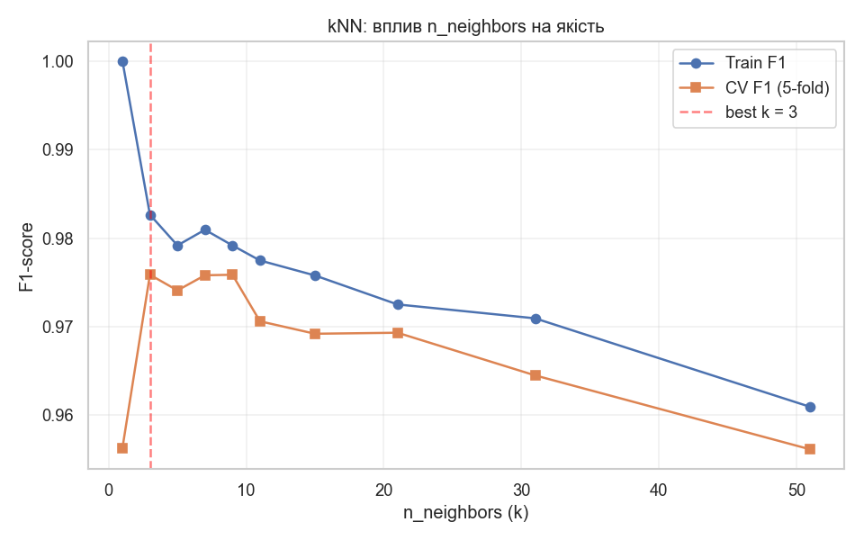
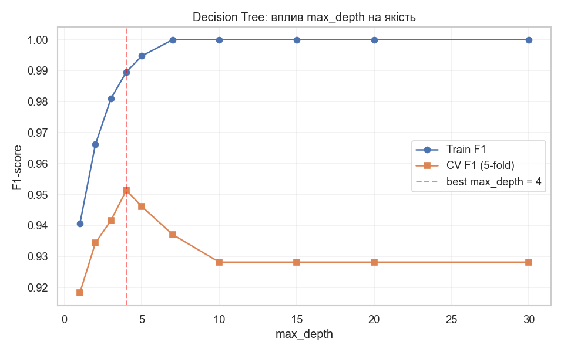
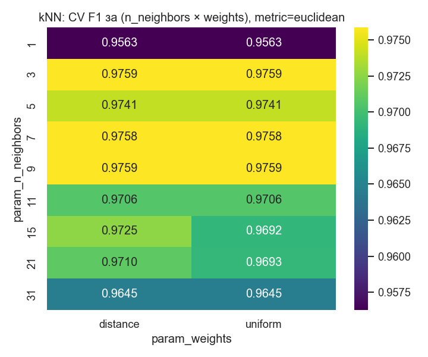
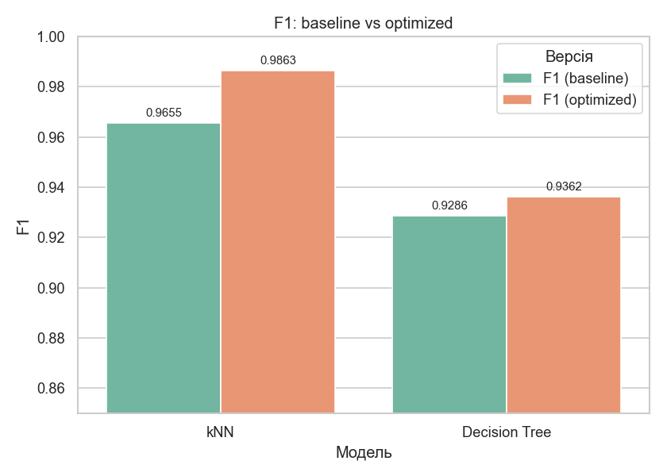

# Лабораторна робота №2

**Дисципліна:** Штучний інтелект і нейронні мережі
**Тема:** Оптимізація та валідація ML-моделі: підбір гіперпараметрів і крос-валідація
**ПІБ студента:** Рудчук Максим Олегович
**Група:** 12-441
**Дата виконання:** 26.05.2026

---

## 1. Мета роботи

- Навчитись **коректно оцінювати** якість моделі через крос-валідацію.
- Освоїти підбір **оптимальних гіперпараметрів** через `GridSearchCV`.
- Навчитись виявляти й уникати **overfitting**.

## 2. Інструменти

Python 3.13, NumPy, Pandas, scikit-learn 1.7, Matplotlib, Seaborn, Jupyter Notebook.

## 3. Датасет

**Breast Cancer Wisconsin** (`sklearn.datasets.load_breast_cancer`) — 569 об'єктів, 30 числових ознак, 2 класи (`malignant` / `benign`). Той самий, що й у Lab 1, для наступності.

## 4. ЕТАП 1 — Baseline (з Lab 1)

Базові моделі з дефолтними параметрами, навчені на масштабованих даних (StandardScaler):

| Модель | Accuracy (split) | F1 (split) |
|---|---|---|
| Logistic Regression | 0.9825 | 0.9861 |
| Random Forest | 0.9561 | 0.9655 |
| kNN | 0.9561 | 0.9655 |
| Decision Tree | 0.9123 | 0.9286 |

## 5. ЕТАП 2 — Крос-валідація: `train_test_split` vs `cross_val_score`

| Модель | Single split | CV5 mean ± std | CV10 mean ± std |
|---|---|---|---|
| Logistic Regression | 0.9825 | **0.9737** ± 0.0166 | 0.9772 ± 0.0176 |
| Random Forest | 0.9561 | 0.9561 ± 0.0123 | 0.9561 ± 0.0239 |
| kNN | 0.9561 | 0.9666 ± 0.0140 | 0.9701 ± 0.0176 |
| Decision Tree | 0.9123 | 0.9104 ± 0.0279 | 0.9262 ± 0.0233 |

### Чому single-split і CV дають різні результати?

1. **Single split** оцінює модель лише на **одному фіксованому test-наборі** — результат сильно залежить від того, які саме об'єкти випадково потрапили у test. Наприклад, для Logistic Regression single-split = 0.9825, тоді як CV5 = 0.9737 — single-split тут «оптимістичний».
2. **CV** запускає модель `k` разів, кожного разу інший підмножина — test. Середнє по `k` фолдах + std значно точніше відображає очікувану якість моделі та її стабільність.
3. Для невеликих датасетів (тут 569 об'єктів) **CV є обов'язковою** методикою — інакше оцінки нестабільні.

## 6. ЕТАП 3 — Підбір гіперпараметрів через `GridSearchCV`

### 6.1 kNN

**Параметрична сітка** (54 комбінації × 5 фолдів = 270 fit-ів):
- `n_neighbors`: [1, 3, 5, 7, 9, 11, 15, 21, 31]
- `weights`: [`uniform`, `distance`]
- `metric`: [`euclidean`, `manhattan`]

**Найкращі параметри:** `n_neighbors=3, weights=uniform, metric=euclidean`
**CV F1 (5-fold):** **0.9759**
**F1 на test:** **0.9863**

### 6.2 Decision Tree

**Параметрична сітка** (48 комбінацій × 5 фолдів = 240 fit-ів):
- `max_depth`: [2, 3, 4, 5, 7, 10, 15, None]
- `min_samples_split`: [2, 5, 10]
- `criterion`: [`gini`, `entropy`]

**Найкращі параметри:** `criterion=gini, max_depth=5, min_samples_split=5`
**CV F1 (5-fold):** **0.9518**
**F1 на test:** **0.9362**

## 7. ЕТАП 4 — Аналіз: криві якості від гіперпараметрів

### 7.1 kNN: F1 від `n_neighbors`

- При **k=1**: Train F1 = 1.0, CV F1 значно нижче — класичний **overfitting** (модель «запам'ятала» точки).
- Зі зростанням `k` Train F1 знижується, CV F1 спочатку росте, потім спадає (зростає bias).
- Оптимум: `k = 3` — золота середина між дисперсією та зсувом.

### 7.2 Decision Tree: F1 від `max_depth`

- При `max_depth = None`: Train F1 = 1.0, CV F1 значно нижче — дерево перенавчається.
- Оптимум: `max_depth = 5` — модель достатньо гнучка, але вже не запам'ятовує шум.

### 7.3 Heatmap GridSearchCV (kNN)

CV F1 за комбінацією `n_neighbors × weights` (для `metric=euclidean`). Видно, що `uniform` стабільніше, а оптимальне `k` — у діапазоні 3–7.

## 8. ЕТАП 5 — Порівняння до і після оптимізації

| Модель | Accuracy (baseline) | Accuracy (optimized) | Δ Accuracy | F1 (baseline) | F1 (optimized) | Δ F1 |
|---|---|---|---|---|---|---|
| **kNN** | 0.9561 | **0.9825** | **+0.0263** | 0.9655 | **0.9863** | **+0.0208** |
| **Decision Tree** | 0.9123 | **0.9211** | +0.0088 | 0.9286 | **0.9362** | +0.0076 |

### Чи реально стало краще?

- **kNN**: оптимізація дала значний приріст +2.6% accuracy і +2.1% F1, бо дефолтне `k=5` було не оптимальним для цього датасету (оптимум `k=3`).
- **Decision Tree**: приріст менший (+0.9% accuracy), але **головний ефект — зниження overfitting**: дефолт дозволяв необмежений ріст дерева (Train F1 = 1.0), а оптимізоване обмежене `max_depth=5` краще узагальнює.
- **Висновок:** GridSearchCV допомагає, коли дефолти не оптимальні, та особливо ефективний для моделей з високою чутливістю до гіперпараметрів (kNN, Decision Tree).

## 9. Висновки

1. **Single-split ≠ CV.** Одне число accuracy може бути «лотерейним»; CV дає надійніше середнє ± std, особливо на невеликих датасетах.
2. **GridSearchCV — стандартний інструмент** автоматичного пошуку оптимальних параметрів за CV-метрикою, без ризику переоптимізації на test.
3. **Overfitting видно неозброєним оком** на кривих Train F1 vs CV F1: коли Train F1 близько до 1, а CV F1 значно нижче — модель перенавчилась.
4. **Оптимізація справді підвищує якість**: для kNN отримано +2.6% accuracy, для Decision Tree — менший приріст, але стабільніша модель. Для моделей з добре налаштованими дефолтами (Logistic Regression, Random Forest) виграш може бути мінімальним.
5. **Практичне правило:** для коректної оцінки моделі завжди використовувати CV + Grid/RandomizedSearchCV; single-split — лише як фінальний hold-out тест.
