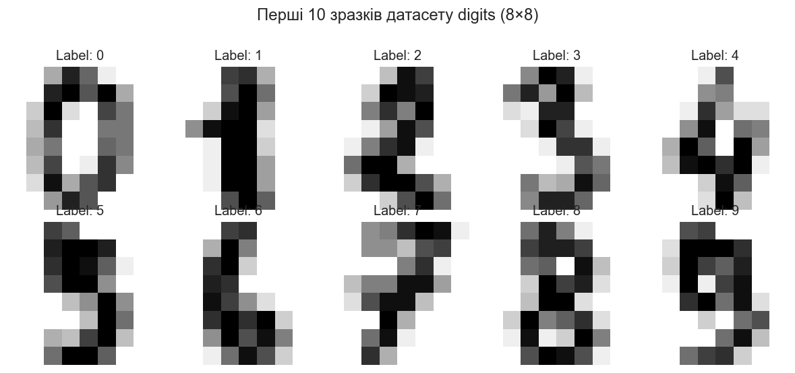
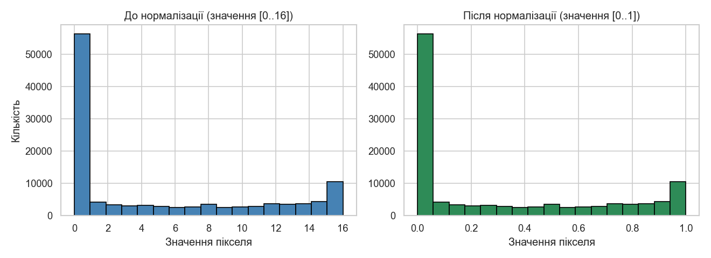
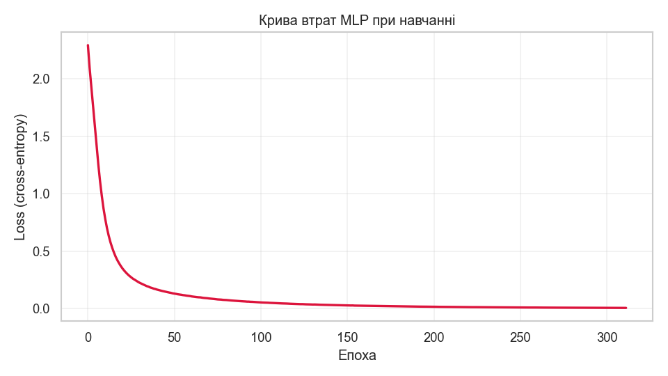
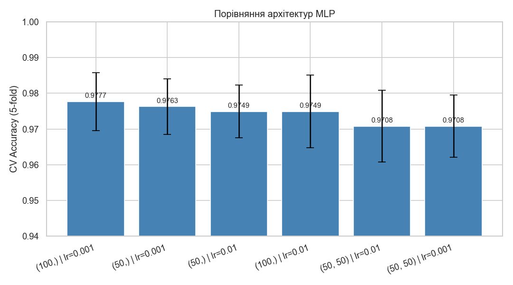
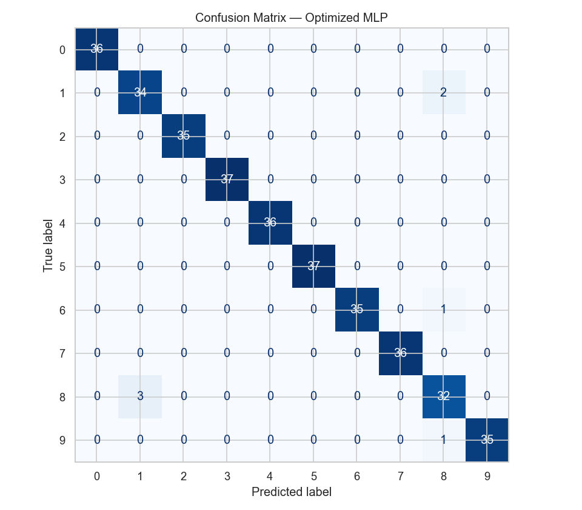
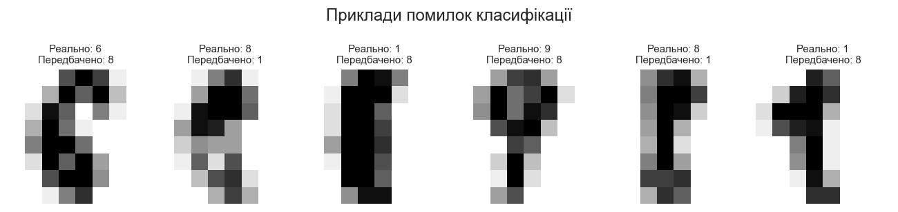

# Лабораторна робота №3

**Дисципліна:** Штучний інтелект і нейронні мережі
**Тема:** Розпізнавання образів за допомогою багатошарового перцептрона (MLP)
**ПІБ студента:** Рудчук Максим Олегович
**Група:** 12-441
**Дата виконання:** 26.05.2026

---

## 1. Мета роботи

- Освоїти архітектуру **багатошарового перцептрона (MLP)** на прикладі задачі розпізнавання рукописних цифр.
- Навчитись готувати дані для нейромережі (нормалізація).
- Підібрати оптимальні гіперпараметри через `GridSearchCV`.
- Проаналізувати помилки моделі через матрицю помилок.

## 2. Теоретичні відомості

**Штучний нейрон** обчислює `y = f(Σ wᵢxᵢ + b)`, де `wᵢ` — ваги, `b` — зміщення, `f` — функція активації.

**MLP** складається з:
- **Вхідного шару** (тут 64 нейрони = 8×8 пікселів);
- **Прихованих шарів** з ReLU-активацією — будують ієрархію ознак;
- **Вихідного шару** (10 нейронів = 10 цифр) з softmax.

**Функція активації ReLU**: `f(x) = max(0, x)` — швидко обчислюється, не страждає від vanishing gradient на додатних значеннях.

## 3. Датасет

`sklearn.datasets.load_digits` — **1797 рукописних цифр** 8×8 у відтінках сірого (значення пікселів 0–16), 10 класів (`0`–`9`). Класи розподілені приблизно рівномірно (174–183 об'єкти на клас).

## 4. КРОК 1–2 — Підготовка даних

1. Завантажено `digits.data` форми (1797, 64).
2. **Нормалізовано** `X = digits.data / 16.0` у діапазон [0, 1].
3. `train_test_split(test_size=0.2, stratify=y, random_state=42)` → train 1437, test 360.

## 5. КРОК 3 — Baseline (Logistic Regression)

| Модель | Accuracy | F1 macro |
|---|---|---|
| Logistic Regression | **0.9556** | 0.9549 |

## 6. КРОК 4 — Базовий MLP

**Архітектура:** один прихований шар на 100 нейронів, ReLU, `max_iter=500`.

| Параметр | Значення |
|---|---|
| Test Accuracy | **0.9806** |
| Test F1 macro | 0.9805 |
| Епох до збіжності | 312 |
| Фінальний loss | 0.0062 |

Loss швидко спадає у перші ~50 епох і виходить на плато — мережа збіжна, перенавчання не критичне.

## 7. КРОК 5 — Оптимізація (GridSearchCV)

**Параметрична сітка** (6 комбінацій × 5 фолдів = 30 fit-ів):
- `hidden_layer_sizes`: `(50,)`, `(100,)`, `(50, 50)`
- `learning_rate_init`: `0.001`, `0.01`

**Найкращі параметри:** `hidden_layer_sizes=(100,)`, `learning_rate_init=0.001`
**Найкращий CV Accuracy:** 0.9777
**Test Accuracy:** **0.9806** | F1 macro: 0.9805

### Зведена таблиця всіх комбінацій:

| Архітектура | lr | CV Acc | CV Std | Train Acc |
|---|---|---|---|---|
| **(100,)** | **0.001** | **0.9777** | 0.0081 | 1.0 |
| (50,) | 0.001 | 0.9763 | 0.0078 | 1.0 |
| (50,) | 0.010 | 0.9749 | 0.0074 | 1.0 |
| (100,) | 0.010 | 0.9749 | 0.0102 | 1.0 |
| (50, 50) | 0.010 | 0.9708 | 0.0100 | 1.0 |
| (50, 50) | 0.001 | 0.9708 | 0.0087 | 1.0 |

**Спостереження:** для цього (відносно простого) датасету одношарова мережа `(100,)` працює краще за двошарову `(50, 50)` — додаткова глибина без більшої кількості параметрів зайва. Менше `lr=0.001` даєт стабільнішу збіжність.

## 8. КРОК 6 — Аналіз помилок

**Per-class precision/recall:**

| Цифра | Precision | Recall | F1 |
|---|---|---|---|
| 0, 2, 3, 4, 5, 7 | 1.0000 | 1.0000 | 1.0000 |
| 1 | 0.9189 | 0.9444 | 0.9315 |
| 6 | 1.0000 | 0.9722 | 0.9859 |
| 8 | 0.8889 | 0.9143 | 0.9014 |
| 9 | 1.0000 | 0.9722 | 0.9859 |

**Топ помилок:**

| Реально | Передбачено | Кількість |
|---|---|---|
| 8 | 1 | 3 |
| 1 | 8 | 2 |
| 6 | 8 | 1 |
| 9 | 8 | 1 |

Усього 7 помилок з 360 (1.9%). Найважче моделі дається пара **1↔8** — обидві цифри мають вертикальну вісь і за низької роздільної здатності (8×8) візуально схожі. Цифра **8** найчастіше «притягує» помилки і з боку 6, і з боку 9.

## 9. КРОК 7 — Підсумкове порівняння

| Модель | Accuracy | F1 macro |
|---|---|---|
| Logistic Regression (baseline) | 0.9556 | 0.9549 |
| MLP (100,) — default | 0.9806 | 0.9805 |
| **MLP — optimized (100,), lr=0.001** | **0.9806** | **0.9805** |

**Висновок щодо приросту:** MLP дав +2.5% accuracy порівняно з Logistic Regression — нелінійна модель краще схоплює просторову структуру пікселів. GridSearchCV підтвердив, що дефолтні параметри (100,)/lr=0.001 вже є оптимальними, тому додаткового приросту не дав — але дослідження інших архітектур було необхідним для обґрунтованого вибору.

## 10. Контрольні запитання

**1. Яку роль відіграють ваги (w) та зміщення (b) у нейроні?**

Ваги `wᵢ` визначають важливість кожного входу: модель навчається саме шляхом зміни ваг через backpropagation. Зміщення `b` зсуває аргумент функції активації — без нього модель змушена проходити через початок координат, що різко обмежує її гнучкість і здатність апроксимувати функції зі зсувом.

**2. Навіщо потрібна функція активації (ReLU)? Що було б без неї?**

Без нелінійної активації будь-яка нейромережа з будь-якою кількістю шарів математично еквівалентна одній лінійній моделі: суперпозиція лінійних функцій лишається лінійною. ReLU вводить нелінійність, дозволяючи моделювати складні залежності. Її переваги над sigmoid/tanh:
- Швидке обчислення (тільки одне порівняння).
- Відсутність vanishing gradient на додатних значеннях.
- Розріджена активація (багато нейронів видають точно 0), що пришвидшує навчання.

**3. Чому перед навчанням нейронної мережі дані обов'язково потрібно нормалізувати?**

Градієнтні методи (SGD, Adam) працюють стабільно, коли всі ознаки мають схожий масштаб. Якщо одна ознака у [0, 16], а інша [0, 1], градієнти по ним мають різний порядок, що:
- сповільнює збіжність (оптимізатор «зигзагує»);
- може призвести до розходження при більших learning rate;
- розбалансовує ваги під час ініціалізації.

ReLU особливо чутлива: дуже великі додатні входи створюють великі градієнти, що можуть «вибити» нейрони.

**4. Як впливає кількість прихованих шарів та нейронів на точність та швидкість?**

| Аспект | Більше нейронів/шарів | Менше |
|---|---|---|
| Виразна потужність | ↑ (може моделювати складніші функції) | ↓ (ризик underfitting) |
| Час навчання | ↑↑ | ↓ |
| Кількість параметрів | ↑↑ | ↓ |
| Ризик overfitting | ↑ (особливо на малих даних) | ↓ |
| Чутливість до lr | вище | нижче |

У нашому експерименті `(50, 50)` мала більше шарів, але **гірший** CV accuracy за `(100,)` — приклад того, що «більше» не завжди означає «краще».

**5. Принцип роботи Confusion Matrix у мультикласовій класифікації**

Для `K` класів матриця має розмір `K × K`. Елемент `C[i][j]` = кількість об'єктів **реального** класу `i`, передбачених як `j`.

- **Діагональ** (`i == j`) — правильні передбачення; сума діагоналі / total = accuracy.
- **Рядок `i`** показує, як розподілився реальний клас `i` за передбаченнями → recall = `C[i][i] / Σ C[i][:]`.
- **Стовпець `j`** показує, з яких реальних класів модель збирала передбачення `j` → precision = `C[j][j] / Σ C[:][j]`.
- Off-diagonal елементи прямо вказують, **які класи модель плутає** — наприклад, у нас `C[8][1] = 3` означає, що 3 рази реальна 8-ка була класифікована як 1.

## 11. Висновки

1. **MLP успішно вирішив задачу** розпізнавання рукописних цифр з accuracy **0.98** на test, перевершивши Logistic Regression на 2.5%.
2. **Нормалізація обов'язкова** — переведення значень з [0, 16] у [0, 1] забезпечило стабільну та швидку збіжність (~300 епох).
3. **GridSearchCV підтвердив**, що `(100,)` з `lr=0.001` — оптимальна архітектура з 6 розглянутих; додаткові шари тут не допомагають.
4. **Помилки концентруються на парах візуально схожих цифр** (1↔8, 9→8, 6→8) — типове обмеження роздільної здатності 8×8. Для покращення — використати CNN або датасет вищої роздільної здатності (MNIST 28×28).
5. **Confusion matrix — ключовий інструмент** для діагностики мультикласового класифікатора: вона показує не лише «скільки» помилок, а й «якого типу», що дозволяє цілеспрямовано покращувати модель.
