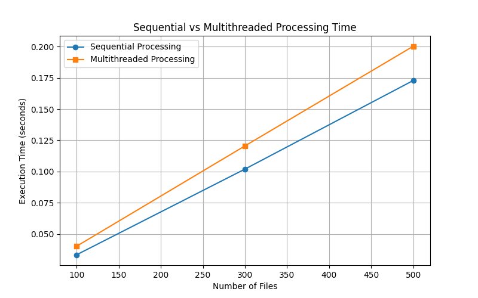

# Результати вимірювання продуктивності

Було проведено тестування продуктивності обробки файлів двома способами:
1. **Послідовна обробка** (обробка кожного файлу по черзі в одному потоці).
2. **Багатопотокова обробка** (використання `threading` для конкурентної обробки кожного файлу в окремому потоці).

Тестування проводилося для різних обсягів даних: 100, 300 та 500 файлів по 1000 рядків кожен.

## Таблиця результатів

| Кількість файлів | Послідовна обробка (с) | Багатопотокова обробка (с) | Прискорення (Speedup) |
|------------------|------------------------|----------------------------|-----------------------|
| 100              | 0.0351                 | 0.0420                     | 0.83x                 |
| 300              | 0.1039                 | 0.1214                     | 0.86x                 |
| 500              | 0.1769                 | 0.2068                     | 0.86x                 |

*(Час виконання може дещо відрізнятися при повторних запусках скрипта, проте загальна тенденція зберігається).*

## Графік порівняння часу

## Аналіз результатів

На основі отриманих результатів (швидкодія менша за 1x) можна зробити висновок, що використання класичної багатопотоковості (`threading`) у Python не дає збільшення продуктивності для даного завдання, а навпаки, незначно уповільнює процес. 

Причини цього:
1. **Global Interpreter Lock (GIL) у Python:** Оскільки підрахунок слів та символів у рядках — це CPU-bound завдання, GIL не дозволяє виконувати кілька потоків одночасно на різних ядрах процесора у CPython.
2. **Витрати на створення та перемикання:** Створення потоків і перемикання контексту між ними вимагає додаткового часу операційної системи. Коли завдання є швидким (файли невеликі), витрати на керування потоками перевищують вигоду від конкурентного виконання.
3. **Обмеження дискової підсистеми:** Конкурентне читання сотень дрібних файлів із диска може призводити до черг та затримок на рівні дискової підсистеми або ОС, замість оптимізованого послідовного читання.

Для покращення результатів у подібних I/O та частково CPU завдань у Python рекомендується використовувати модуль `multiprocessing` (який обходить GIL створюючи окремі процеси) або асинхронне програмування (`asyncio` чи `aiofiles`), які оптимізують очікування дискового вводу-виводу.
