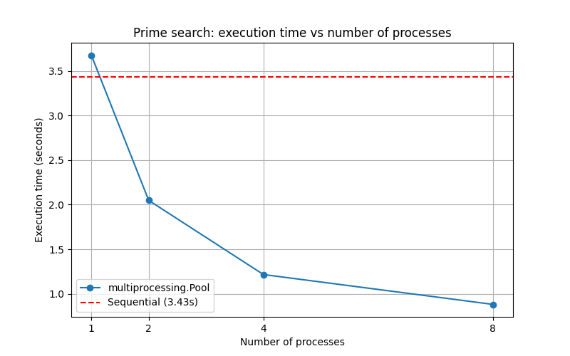

# Результати вимірювання продуктивності

Було реалізовано CPU-інтенсивну задачу — пошук простих чисел методом перевірки дільниками (trial division з обмеженням до √n) — і порівняно дві стратегії виконання:

1. **Послідовна обробка** (`sequential_primes.py`) — перевірка кожного числа по черзі в одному процесі.
2. **Багатопроцесорна обробка** (`multiprocessing_primes.py`) — використання `multiprocessing.Pool.map` з різною кількістю процесів (1, 2, 4, 8).

## Параметри експерименту

- Кількість чисел: **50 000**
- Діапазон значень: `100 000 000` – `10 000 000 000` (10⁸ – 10¹⁰)
- CPU: 12 логічних ядер
- Знайдено простих чисел: **2 302** (однаково для всіх режимів — валідація коректності)

> Примітка: діапазон збільшено відносно базової специфікації (10 000 – 10 000 000), оскільки на оригінальному діапазоні послідовний пошук завершується за ~30 мс, що менше за накладні витрати на створення процесів і не дозволяє продемонструвати ефект паралелізму.

## Таблиця результатів

| Режим            | Процесів | Час (с) | Прискорення |
|------------------|----------|---------|-------------|
| Послідовно       | 1        | 3.4799  | 1.00x       |
| `Pool(1)`        | 1        | 3.7085  | 0.94x       |
| `Pool(2)`        | 2        | 2.0470  | 1.70x       |
| `Pool(4)`        | 4        | 1.2215  | 2.85x       |
| `Pool(8)`        | 8        | 0.8833  | 3.94x       |

Прискорення = `час_послідовно / час_N`.

## Графік порівняння часу

## Аналіз результатів

1. **`Pool(1)` повільніший за послідовний (0.94x)** — це очікувано: створення воркер-процесу через `fork`/`spawn`, серіалізація списку чисел через pickle та повернення результатів додають фіксовані накладні витрати, які не компенсуються паралельністю при єдиному процесі.

2. **Прискорення зростає майже лінійно до 4 процесів (2.85x на 4 ядрах)**, що відповідає теоретичній межі для CPU-bound задачі без GIL-обмежень — кожен процес має власний інтерпретатор і виконується на окремому ядрі.

3. **8 процесів дають 3.94x, а не 8x** — основні причини:
   - **Hyper-threading**: машина має 12 логічних ядер, але лише ~6 фізичних. Гіпертред-ядра ділять виконавчі блоки, тож для чисто-обчислювальної задачі їх «віддача» менша за фізичне ядро.
   - **Накладні витрати IPC**: серіалізація/десеріалізація списку та результатів через pickle.
   - **Нерівномірність роботи**: чек простоти для простих чисел повільніший, ніж для складених (виходить достроково на перших дільниках), тому при погано підібраному `chunksize` деякі воркери простоюють.

4. **GIL не є проблемою**: кожен `Process` у Pool має власний інтерпретатор Python з власним GIL, тож код реально виконується паралельно — на відміну від `threading` (див. ЛР1).

## Висновок щодо масштабування

Оптимальною кількістю процесів для цієї задачі на даному CPU є **кількість фізичних ядер** (≈4–6). Подальше нарощування процесів дає лише незначний приріст за рахунок hyper-threading і поступово впирається у накладні витрати міжпроцесної взаємодії.
